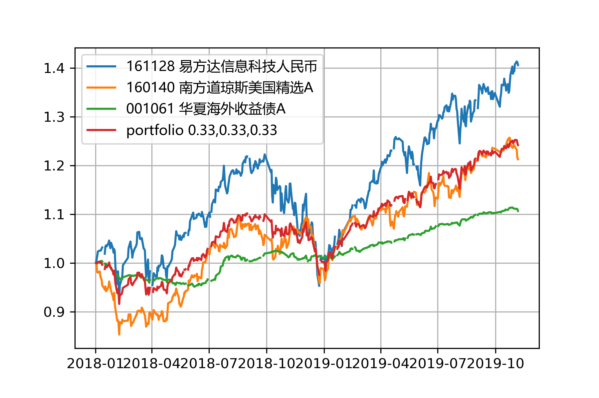

# FundData
#### This Python program fetches historical data of mutual funds in China from http://funds.hexun.com/
The code was written in and tested with Python 3.7 (Anaconda 4.8).

## Usage
#### Run the program with command line arguments of start date, end date and a list of fund codes
#### Example:
python funddata.py 2018-04-01 2021-04-01 161130 161128 513050 510310 001832

## A plot of accumulated net values (fld_netvalue) for the example

