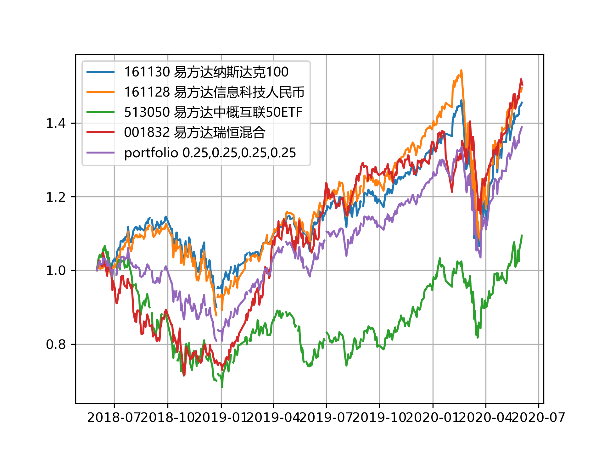

# FundData
#### This Python program fetches historical data of mutual funds in China from http://funds.hexun.com/
The code was written in and tested with Python 3.6 (Anaconda 4.4.0).

## Usage
#### Run funddata.py with command line arguments of start date, end date and a list of fund codes
#### Example:
python funddata.py 2014-01-01 2017-08-31 110020 160119 040008 110011

## Plot of unit net values

## Plot of accumulated net values

